# GoFr_Assignment

## To run:
```
git clone https://github.com/udittripathi/GoFr_Assignment.git
```

```
go run main.go
```


This Go program creates a simple HTTP API for managing information about cars. The program uses the gofr framework for handling HTTP requests and interactions with a database. Here's a brief overview of the functionality:

  1. Create Car Information:
     + Endpoint: POST /carinfo
     + Parses a JSON request body containing car information.
     + Inserts the car information into a database table named "cars."

  2. List All Cars:
     + Endpoint: GET /car
     + Retrieves a list of all cars from the "cars" table in the database.

  3. Get Car by ID:
     + Endpoint: GET /car/{id}
     + Retrieves information for a specific car based on the provided car ID.
 
  4. Complete Car Repair:
     + Endpoint: POST /completeRepair/{id}
     + Updates the repair status of a car to "Completed" in the database. If the status is already "Completed," it returns a message indicating that the repair status is already completed.

  5. Delete Car Entry:
     + Endpoint: DELETE /deleteCar/{id}
     + Deletes a car entry from the database. If the repair status is "Completed," it allows deletion; otherwise, it returns a message indicating that deletion is not allowed until the repair status is completed.

The program initializes a gofr object, sets up various HTTP endpoints for handling CRUD operations on car information, connects to a database, and starts an HTTP server to listen for incoming requests. The database operations involve inserting, querying, updating, and deleting records in the "cars" table.

## Task lists

- [x] CRUD Operations: Build APIs for create, read, update and delete operations for all entities.
- [x] DB Integration: The API should have integration with database for persistence of data. Any SQL or NoSQL DB, which has a freely available docker image, may be used.
- [x] Postman collection for trying out the APIs.
- [x] Sequence diagrams, UML diagrams.
- [x] committing and pushing the code to the repo.
- [x] Include a README.md file describing the project functionalities. Also, do provide clear instructions on running the project and testing the API..


## To Test APIs in Postman

 1. Create Car:   
    + Method: POST
    + URL: http://localhost:9000/carinfo
    + Body: JSON with car information.
  + Eg:
     > {
     >    "make": "Toyota",
     >    "model": "Camry",
     >    "entry_time": "2023-12-12T12:00:00Z",
     >    "repair_status": "In Progress"
     > }

| POSTMAN                | Terminal                |
| ---------------------- | ---------------------- |
| 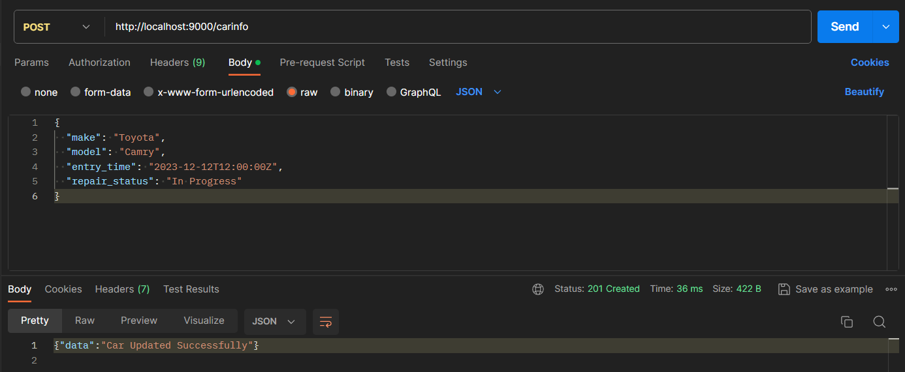 | 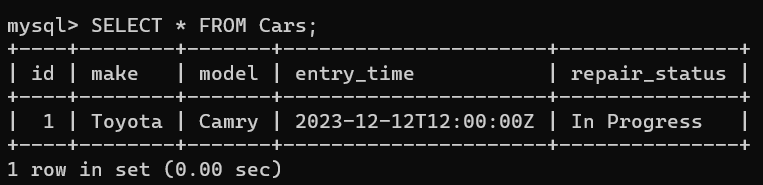 |

 2. List All Cars:
    + Method: GET
    + URL: http://localhost:9000/car
    + Check that the response contains a list of cars.

| POSTMAN                | Terminal                |
| ---------------------- | ---------------------- |
| 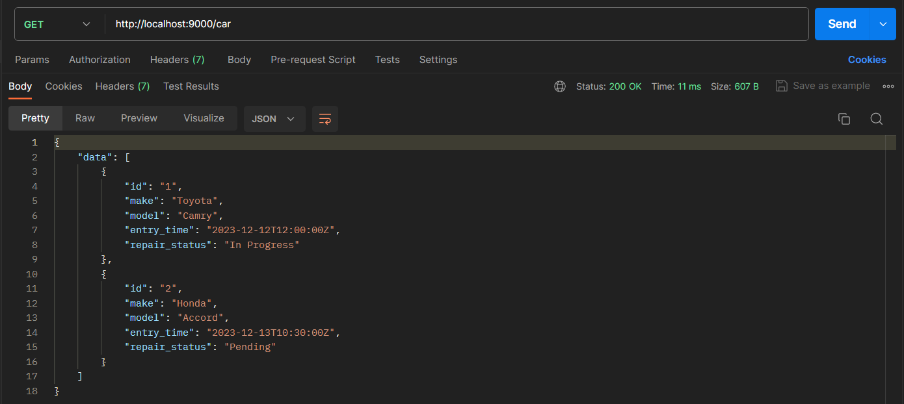 | 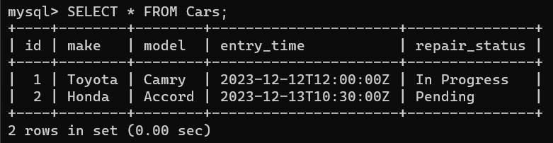 |

 3. Get Car by ID:
    + Method: GET
    + URL: http://localhost:9000/car/{id}
    + Replace {id} with a valid car ID.
    + Check that the response contains details of the specified car.

| POSTMAN                | Terminal                |
| ---------------------- | ---------------------- |
| 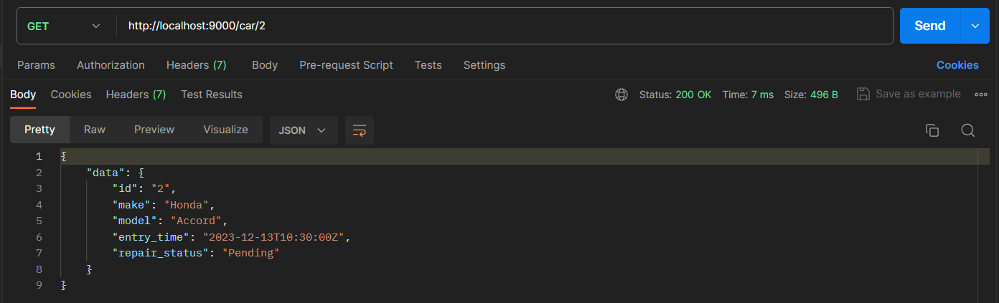 | 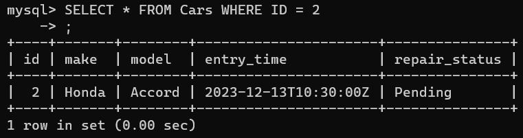 |

 4. Complete Car Repair:
    + Method: POST
    + URL: http://localhost:9000/completeRepair/{id}
    + Replace {id} with a valid car ID.
    + Check that the response indicates successful repair completion.

| POSTMAN                | Terminal                |
| ---------------------- | ---------------------- |
| 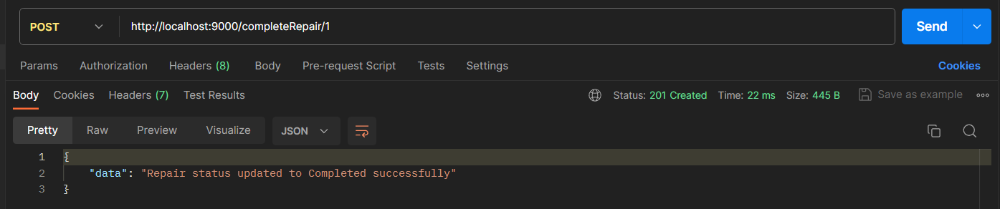 | 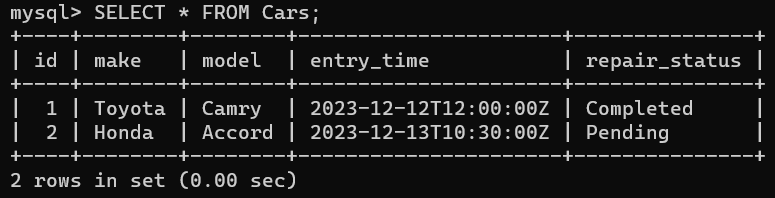 |    

 5. Delete Car Entry:
    + Method: DELETE
    + URL: http://localhost:9000/deleteCar/{id}
    + Replace {id} with a valid car ID.
    + Check that the response indicates successful deletion.   

| POSTMAN                | Terminal                |
| ---------------------- | ---------------------- |
| 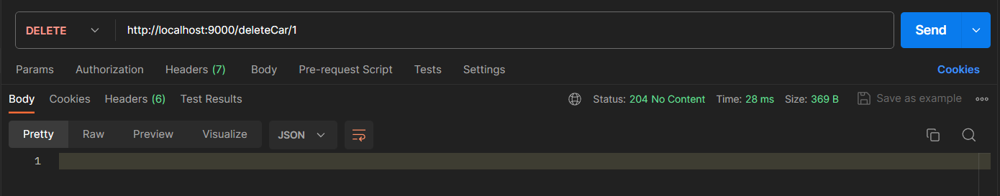 | 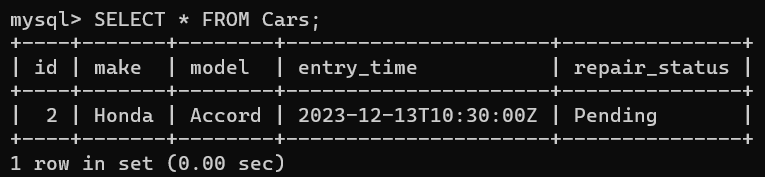 |      


## Sequence Diagram
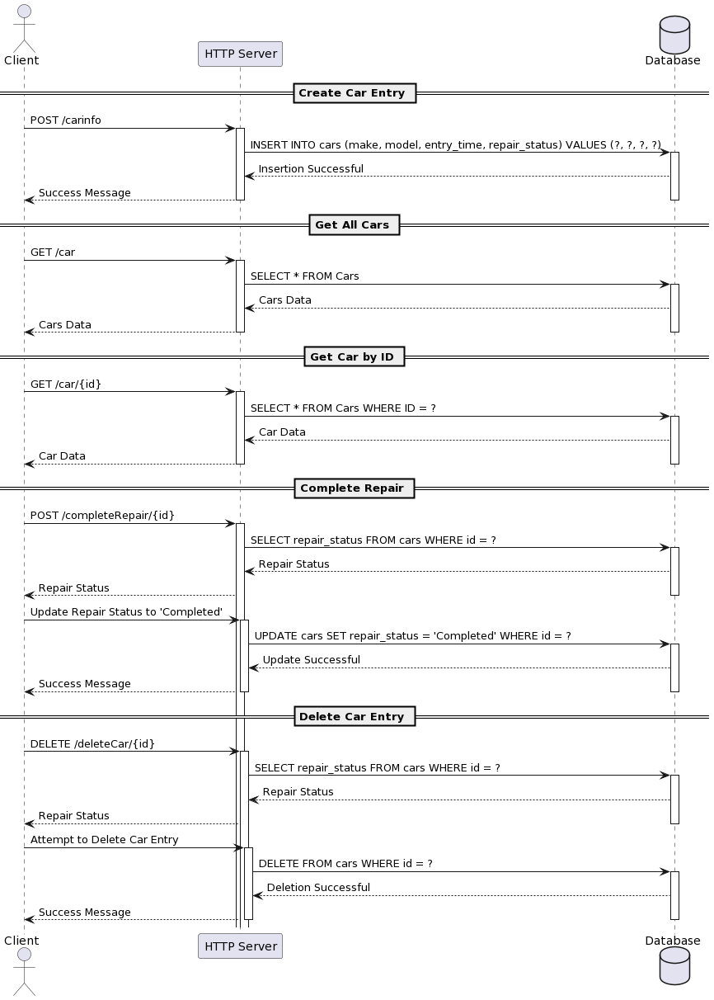

## UML Diagram
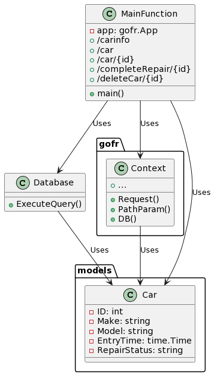
